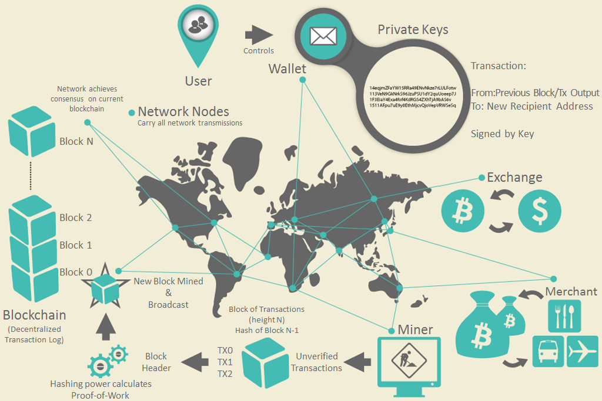

> for simplicity, this article only deals with full node, P2PKH


<figcaption>Bitcoin overview</figcaption>

- Bitcoin network is maintained by nodes.
- Just as the internet runs on http protocol, bitcoin nodes interact with each other on bitcoin protocol
- Nodes are computers that are running bitcoin software
- Each node( full node ) saves a copy of bitcoin transaction data
- **"coin"** or **"balance"** does not exist in bitcoin
- Instead, bitcoin saves **transactions**. With transaction data, bitcoin software can calculate **UTXO**( Unspent Transaction Output ) to prove how much bitcoins an address owns
- Each UTXO can only be spent by a specific user
- Transfering a bitcoin from one address to another means to eventually generate a new transaction
```js
// how a transaction data looks like
{
  "version": 1,
  "locktime": 0,
  "vin": [
    {
      "txid": "7957a35fe64f80d234d76d83a2a8f1a0d8149a41d81de548f0a65a8a999f6f18",
      "vout": 0,
      "scriptSig" : "3045022100884d142d86652a3f47ba4746ec719bbfbd040a570b1deccbb6498c75c4ae24cb02204b9f039ff08df09cbe9f6addac960298cad530a863ea8f53982c09db8f6e3813[ALL] 0484ecc0d46f1918b30928fa0e4ed99f16a0fb4fde0735e7ade8416ab9fe423cc5412336376789d172787ec3457eee41c04f4938de5cc17b4a10fa336a8d752adf",
      "sequence": 4294967295
    }
  ],
  "vout": [
    {
      "value": 300,
      "scriptPubKey": "OP_DUP OP_HASH160 ab68025513c3dbd2f7b92a94e0581f5d50f654e7 OP_EQUALVERIFY OP_CHECKSIG"
    },
    {
      "value": 100,
      "scriptPubKey": "OP_DUP OP_HASH160 7f9b1a7fb68d60c536c2fd8aeaa53a8f3cc025a8 OP_EQUALVERIFY OP_CHECKSIG",
    }
  ]
}
```

- 
  <figcaption>How UTXO set changes as transactions occur overtime</figcaption>

- This is a brief summary of what happens when person X transfers 300 bitcoins to person Y. 
1. Search through every transactions that exists ( since the genesis block )
1. For each transaction, generate signature with X's private key and the transaction data. Combine this signature and X's public key to generate an unlocking script( scriptSig )
1. Combine this unlocking script( scriptSig ) with the transaction's output's locking script( scriptPubKey ) to prove that X can spend that transaction's output
1. X should also prove that the output is unspent, iterating through every blocks
1. If proven that X can spend the transaction's output and the output is unspent, that output is added to X's UTXO pool
1. After iterating through every transactions, pick UTXOs from X's UTXO pool to use as inputs of a new transaction. The sum of outputs' value should exceed the amount to transfer, which in this case, is 300
1. Let's say that X picked a input from a transaction that has value 400 as its output
1. X need to transfer 300 bitcoins to Y, so one output has value 300, which can only be spent by Y later, and another output( change ) has value 100, which can only be spent by X later ( transaction fee is not considered for simplicity )
1. Now that transaction data is made, it is broadcasted to other nodes through bitcoin protocol
1. When mining nodes receive this transaction data, they add the data to their mempool( transaction pool )
1. When a mining node includes the transaction to their candidate block's transactions list and wins the competition, the transaction is now recorded in bitcoin chain forever

- This process seems inefficient with all the iterations
- This inefficiency is a result of trade-off with decentralization, but in some level, this inefficiency can be reduced by using caches and data structures, which we will cover in future articles