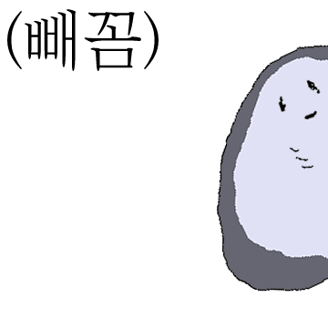

---
---

This is an H1
=============

This is an H2
-------------

# This is a H1
## This is a H2
### This is a H3
#### This is a H4
##### This is a H5
###### This is a H6


> This is a first blockqute.
<!-- >	> This is a second blockqute.
>	>	> This is a third blockqute. -->

1. 첫번째
2. 두번째
3. 세번째

* 빨강
  * 녹색
    * 파랑

+ 빨강
  + 녹색
    + 파랑

- 빨강
  - 녹색
    - 파랑


* 1단계
  - 2단계
    + 3단계
      + 4단계

- hello
    - hello
        - hello

This is a normal paragraph:

    This is a code block.
    
end code block.

<pre>
<code>
public class BootSpringBootApplication {
  public static void main(String[] args) {
    System.out.println("Hello, Honeymon");
  }

}
</code>
</pre>


```
public class BootSpringBootApplication {
  public static void main(String[] args) {
    System.out.println("Hello, Honeymon");
  }
}
```

```java
public class BootSpringBootApplication {
  public static void main(String[] args) {
    System.out.println("Hello, Honeymon");
  }
}
```

* * *

***

*****

- - -

---------------------------------------

[link keyword][id]

[id]: URL "Optional Title here"

Link: [Google][googlelink]

[googlelink]: https://google.com "Go google"

* 외부링크: <http://example.com/>
* 이메일링크: <address@example.com>

*single asterisks*

_single underscores_

**double asterisks**

__double underscores__

~~cancelline~~


<br/>

