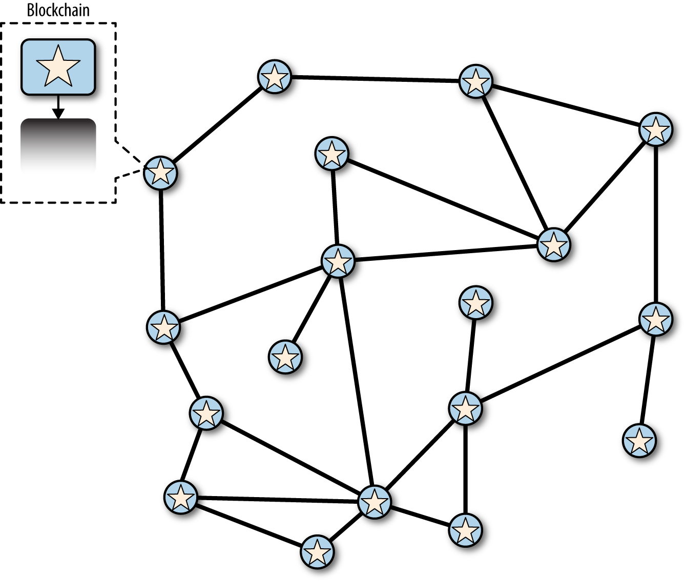

- Every nodes should reach a consensus and save same transactions, same blocks

    <figcaption>A bitcoin network that reached consensus</figcaption>

- When mining bitcoin, if a mining block finds the correct nonce, it propagates a new block( block A ) to other nodes
- If a mining node receives a propagated block( block A ) before finding the nonce, it stops current POW and start POW of the block after the received block
- It takes time for a new block to propagate to every nodes. So, before it's propagated to every node, another node that hasn't received the new node might succeed in POW, and start propagating another new block( block B )

    <figcaption>propagating to different blocks</figcaption>
- In this case, some nodes receives block A before block B, while some nodes receives block B before block A. When this happens, a bitcoin network is **forked**.

    <figcaption>A forked bitcoin network </figcaption>
- Which block should be selected? block A or block B?
- Mining nodes doesn't care if the network is forked or not. They just keep mining the next node.
- Let's say a mining node succeeded POW, made new block ( block C ) on top of block A, and propagated it to other nodes

    <figcaption>Block C is mined and propagated</figcaption>
- When a node receives block C lengthening block A, the blockchain with block A is longer than the blockchain with block B. This makes blockchain with block A more **credible** then the other. So the node chooses blockchain with block A, and fork is resolved.
- Conventionally, if a network is forked, a node chooses the longest one

    <figcaption>Fork resolved</figcaption>
- Although blockchain with block B is one height shorter then block A, it still has chance to become longer then blockchain with block A
- It's a common sense that if block height differs more than 5 blocks, it's almost impossible for defeated chain to win.
- So, if a block has more than 5 blocks on top of it, it's considered **safe**, meaning that it will not be defeated by another forked blockchain.