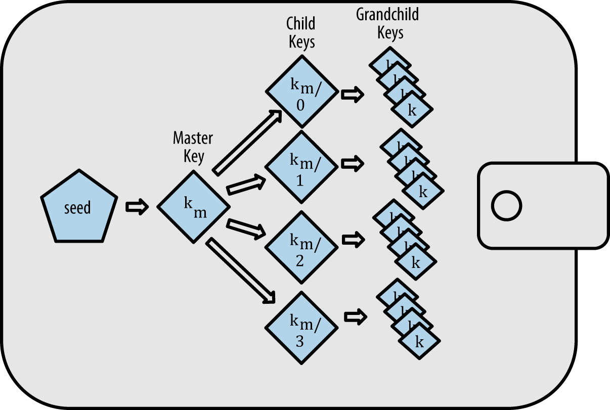

In Bitcoin, **wallet** is a software that manages **keys**.

A user needs private key and public key to use bitcoin.

<figcaption>Private key generating in Hierarchical Deterministic Wallets, "bitcoin book"</figcaption>

A seed generates a master private key, and each private key can generate multiple child private key.

Each private key is used to make a seperate account.

Seeds are represented as word phrases like this.

        army van defense carry jealous true
        garbage claim echo media make crunch

Bitcoin addresses and public keys are generated from private key by applying one way hash function.

<figcaption>How public key and Bitcoin address is generated from private key, "bitcoin book"</figcaption>

Private keys are generated as random 256byte integer.

The one way hash functions bitcoin uses for encryptions includes Elliptic Curve Cryptography, modular prime number p operation, SHA-256, RIPEMD160... and so on. We will cover the math inside it in future articles.

> For simplicity, only Type 2 Hierarchical Deterministic Wallets are considered