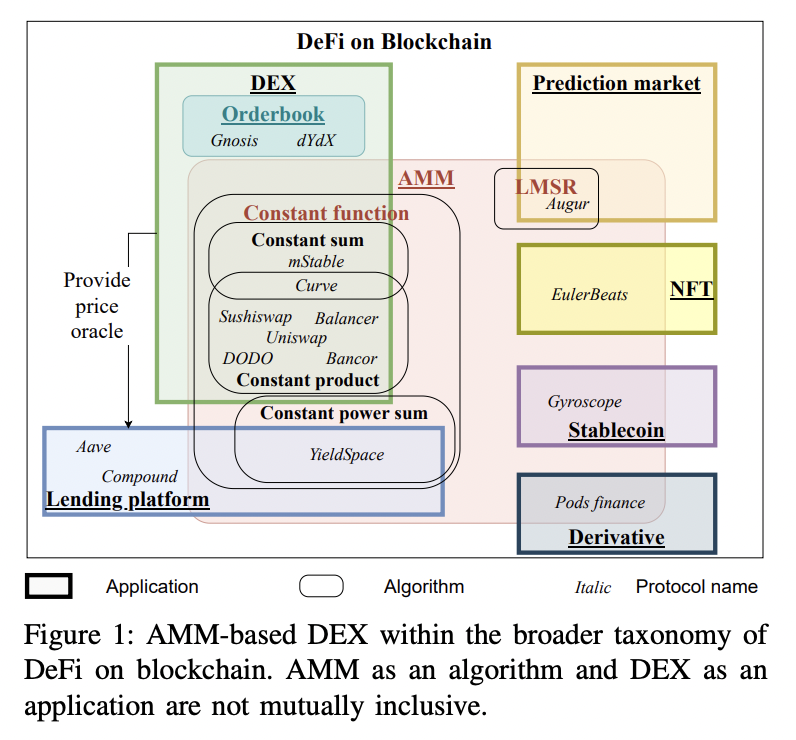

SoK: systematization of knowledge

AMM \
Pros: Provides liquidity and encourage swapping assets \
Cons: Slippage will easily occur. vulnerable to impermanent loss(divergence loss). Also has security issue

A lot of models were proposed to solve this issue, but there were mostly just the same. \
This paper is SoK of AMM-based DEX

Actors

1. Liquidity Providers
2. Traders
3. Protocol Foundation

Assets

1. Risk assets
   - Illiquidity, type of assets the DEX is designed for
2. Base assets
   - In some protocols, risk assets have to be designated with base assets
3. Pool shares
   - Liquidity shares, LP shares. Represents ownership in the portfolio of the assets within a pool
4. Protocol tokens
   - Governance token.

Dynamics

1. Invariant properties
   - conservation function. ex) CPMM
2. Mechanisms
   - asset swapping & liquidity provision/withdrawls

Economy

1. Rewards
   - Liquidity reward - Receive trading fees
   - Staking rewardd - Rewards from staking pool shares or other tokens as part of an initial incentive program from a certain token protocol
   - Governance right - rights to vote for proposals
   - Security reward - bounty programs, auditing, etc.
2. Explicit cost
   - Liquidity withdrawal penalty
   - Swap fee
   - Gas fee
3. Implicit cost
   - Slippage
   - Divergence loss(Impermenant loss)

Order-book-based DEX = Gnosis, dYdX
AMM-based DEX = dominant

