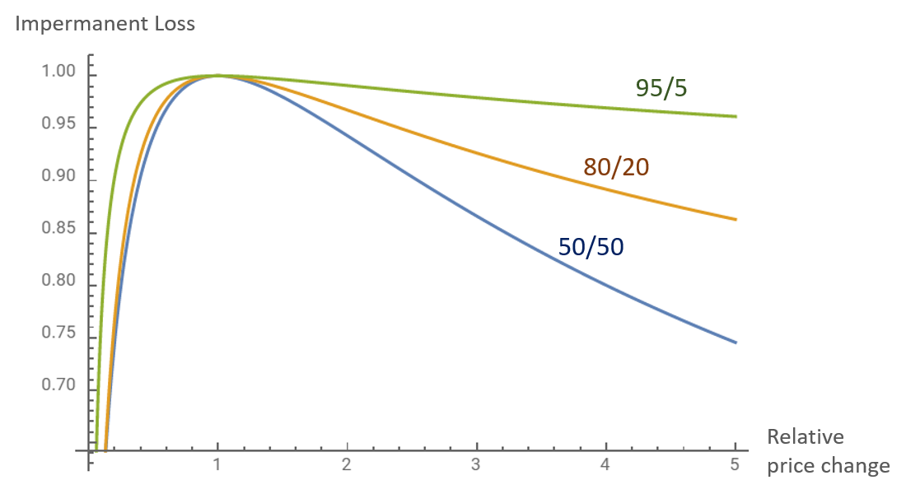

**Unrealized loss that occurs when your share of liquidity provider position becomes uneven compared to it's original position**

- Happens to liquidity providers
- When price of a token goes up, the price of the token in the liquidity pool is cheaper then another exchange, an arbitrage opportunity is created.
- The price of the token goes up, matching the price in another exchange, while volume in the liquidity pool decreases.
- Liquidity provider does gain money through this event, but he would have made more money if he just held his token.
- This also happens when the price of a token drops. Liquidity provider will lose more value by prividing liquidity, then if he just held the token. This loss will be bigger if the price change is larger.

