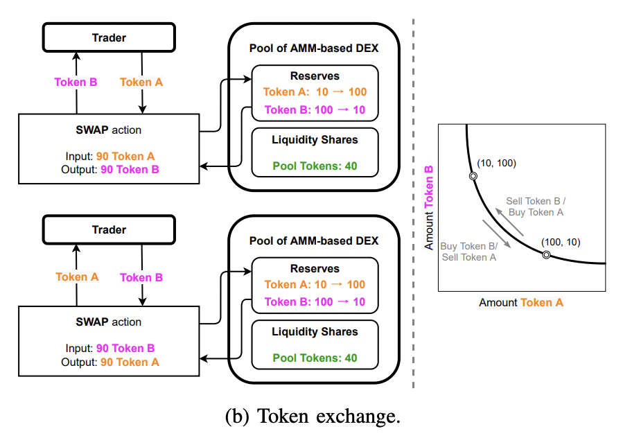

> Summary of [SoK: DEX with AMM Protocols][sokpaperlink]

SoK: systematization of knowledge

**AMM**  
Pros: Provides liquidity and encourage swapping assets \
Cons: Slippage will easily occur. vulnerable to impermanent loss(divergence loss). Also has security issue

A lot of models were proposed to solve this issue, but there were mostly just the same. \
The purpose of this paper is SoK of AMM-based DEX

**Actors**

1. Liquidity Providers
2. Traders
3. Protocol Foundation

**Assets**

1. Risk assets
   - Illiquidity, type of assets the DEX is designed for
2. Base assets
   - In some protocols, risk assets have to be designated with base assets
3. Pool shares
   - Liquidity shares, LP shares. Represents ownership in the portfolio of the assets within a pool
4. Protocol tokens
   - Governance token.

**Dynamics**

1. Invariant properties
   - conservation function. ex) CPMM
2. Mechanisms
   - asset swapping & liquidity provision/withdrawls

**Economy**

1. Rewards
   - Liquidity reward - Receive trading fees
   - Staking reward - Rewards from staking pool shares or other tokens as part of an initial incentive program from a certain token protocol
   - Governance right - rights to vote for proposals
   - Security reward - bounty programs, auditing, etc.
2. Explicit cost
   - Liquidity withdrawal penalty
   - Swap fee
   - Gas fee
3. Implicit cost
   - Slippage
   - Divergence loss(Impermenant loss)

**State space representation**  

state $$\chi$$  
$$\chi = ({\{r_k\}_{k=1,...,n}, \{p_k\}_{k=1,...,n}, C, \Omega})$$

$$r_k = quantity\ of\ token\ k$$  
$$p_k = current\ spot\ price\ of\ token\ k$$  
$$C = conservation\ function\ invariants$$  
$$\Omega = collection\ of\ protocol\ hyperparameters$$

**General rules of AMM-based DEX**

1. Price stays constant for pure liquidity provision and withdrawals
2. Invariants of AMM pool stays constant for pure swapping
   $$ (\{r_k\}, \{p_k\}, \mathcal{C}, \Omega) \xrightarrow{liquidity\ change} (\{r_k\}, \{p_k\}, \mathcal{C}', \Omega)$$  
   $$ (\{r_k\}, \{p_k\}, \mathcal{C}, \Omega) \xrightarrow{swap} (\{r_k'\}, \{p_k'\}, \mathcal{C}, \Omega) $$

- Cisproportionate addition or removal can be viewed as combination of proportionate reserve change plus asset swap
- Swap fees causes $$\mathcal{C}$$ to change. It can be divided into swap and provision

**Generalized formulas**

1. Conservation function (bonding curve)  
   $$\mathcal{C} = C(\{r_k\})$$  
   conservation function for each token $$(r_i - r_o)$$ must be concave, nonnegative, nondecreasing  
   $$Z(\{r_k\};\mathcal{C}) = C(\{r_k\}) - \mathcal{C} = 0$$  
   here, $$\mathcal{C}$$ is determined by initial liquidity provision.  
   For example, if AMM formula is $$XY = k$$, then $$Z = XY - k,\ C(\{r_k\}) = XY,\ \mathcal{C} = k$$
2. Spot exchange rate  
   $$_iE_o(\{r_k\}; \mathcal{C}) = \dfrac{\partial Z(\{r_k\};\mathcal{C})/r_o}{\partial Z(\{r_k\};\mathcal{C})/r_i}$$
3. Swap amount
   input $$x_i$$, output $$x_o$$  
   _a) Update reserve quantities_  
    $$r_i':=R_i(x_i;r_i) = r_i + x_i$$  
    $$r_j' = r_j \ \forall j \neq i,o$$

   _b) Compute new reserve quntity of token o_  
    $$r_o' = R_o(x_i, \{r_k\}; \mathcal{C}) \Leftrightarrow Solving\ Z=0$$

   _c) Compute swapped quntity_  
    $$x_o := X_o(x_i, \{r_k\}; \mathcal{C}) = r_o - r_o'$$

4. Slippage
   $$S(x_i, \{r_k\}; \mathcal{C}) = \dfrac{x_i/x_o}{_iE_o} - 1$$
5. Divergence loss  
   value of token $$o$$ is increased by $$\rho$$ while others stay the same  
   token $$_i$$ is a numeraire.  
   _a) Calculate the original pool value_  
   $$V(\{r_k\}; \mathcal{C}) = \sum_j{_iE_o(\{r_k\}; \mathcal{C}) \cdot r_j }$$

   _b) Calculate the reserve value if held outside of the pool_  
   $$V_{held}(\rho; \{r_k\}, \mathcal{C}) = V(\{r_k\}; \mathcal{C}) + [_iE_o(\{r_k\}; \mathcal{C}) \cdot r_o] \cdot \rho$$

   _c) Obtain re-balanced reserve quantities_  
   $$\rho = \dfrac{_jE_o(\{r_k'\};\mathcal{C})}{_jE_o(\{r_k\};\mathcal{C})} -1$$  
   $$Z(\{r_k'\};\mathcal{C}) = 0$$  
   $$r_k' = R_k(\rho,\{r_k\};\mathcal{C})$$

   _d) Calculate the new pool value_  
   $$V'(\rho,\{r_k'\}; \mathcal{C}) = \sum_j{_iE_j(\{r_k'\};\mathcal{C}) \cdot r_j'}$$

   _e) Calculate the divergence loss_  
   $$L(\rho, \{r_k'\}; \mathcal{C}) = \dfrac{V'(\rho, \{r_k'\}; \mathcal{C})}{V_{held}'(\rho, \{r_k'\}; \mathcal{C})} -1$$

> Formulas of major AMM-based Dex

**Uniswap V2**

a) Conservation function  
$$\mathcal{C} = r_1 \cdot r_2$$

b) Spot exchange rate  
$$_1E_2 = \dfrac{r_1}{r_2}$$

c) Swap amount  
$$r_1' = r_1 + x_1$$  
$$r_2' = \dfrac{\mathcal{C}}{r_1'} $$    
$$x_2 = r_2 - r_2' $$

d) Slippage  
$$S(x_1) = \dfrac{x_1/x_2}{_1E_2} -1 = \dfrac{x_1}{r_1}$$

e) Divergence loss  
$$\dfrac{V}{2} = V_1 = V_2 = r_1$$  
$$V_{held} = V + V_2 \cdot \rho = r_1 \cdot (2 + \rho)$$  
$$\dfrac{V'}{2} = V_1' = V_2' = r_1' = r_1 \cdot \sqrt{1 + \rho}$$  
Note that $$r_2' = \dfrac{r_2}{\sqrt{1 + \rho}}$$ and $$p' = \dfrac{(1 + \rho)r_1}{r_2}$$  
$$L(\rho) = \dfrac{V'}{V_{held}}-1 = \dfrac{\sqrt{1 + \rho}}{1 + \dfrac{\rho}{2}}-1 $$

**Uniswap V3**  
a) Conservation function  
Suppose a user supplies $$\mathcal{C_1}$$ token 1 and $$\mathcal{C_2}$$ token 2  
His liquidity is only provided for swapping within a specific range of exchange rates: $$[\dfrac{\mathcal{C_1}}{\mathcal{C_2}\mathcal{A}}, \dfrac{\mathcal{C_1}\mathcal{A}}{\mathcal{C_2}}]$$ where $$\mathcal{A} > 1$$ and initial exchange rate is $$\dfrac{\mathcal{C_1}}{\mathcal{C_2}}$$  
$$ r_1^{equiv} = \dfrac{\mathcal{C_1}}{1-\dfrac{1}{\sqrt{\mathcal{A}}}}\ and\ r_2^{equiv} = \dfrac{\mathcal{C_2}}{1-\dfrac{1}{\sqrt{\mathcal{A}}}}$$

Conservation function looks like this:  
$$[r_1 + (r_1^{equiv} - \mathcal{C_1})] \cdot [r_2 + (r_2^{equiv} - \mathcal{C_2})] = r_1^{equiv} \cdot r_2^{equiv}$$  
$$(r_1 + \dfrac{\mathcal{C_1}}{\sqrt{\mathcal{A}}-1}) \cdot (r_2 + \dfrac{\mathcal{C_2}}{\sqrt{\mathcal{A}}-1}) = \dfrac{\mathcal{A} \cdot \mathcal{C_1} \cdot \mathcal{C_2}}{(\sqrt{\mathcal{A}}-1)^2}$$

b) Exchange rate  
$$_1E_2 = \dfrac{r_1 + \dfrac{\mathcal{C_1}}{\sqrt{\mathcal{A}}-1}}{r_2 + \dfrac{\mathcal{C_2}}{\sqrt{\mathcal{A}}-1}}$$

c) Swap amount  
$$r_1' = r_1 + x_1$$  
$$r_2' = \dfrac{\mathcal{C_1}\mathcal{C_2}}{(1-\dfrac{1}{\sqrt{\mathcal{A}}})^2} / (r_1' + \dfrac{C_1}{\sqrt{\mathcal{A}}-1}) - \dfrac{\mathcal{C_2}}{\sqrt{\mathcal{A}}-1}$$  
$$x_2' = r_2 - r_2'$$

d) Slippage  
$$S(x_1) = \dfrac{x_1/x_2}{_1E_2} -1 = \dfrac{x_1}{r_1 + \dfrac{\mathcal{C_1}}{\sqrt{\mathcal{A}}-1}}$$

e) Divergence loss

$$
L(\rho) = \dfrac{V'}{V_{held}}-1 \\
=  \begin{cases}
   \dfrac{(\rho +1 ) \cdot \sqrt{\mathcal{A}}-1}{2+\rho},&-1 \le \rho \le \dfrac{1}{\mathcal{A}}-1 \\
   \dfrac{\dfrac{\sqrt{1+\rho}}{1+\dfrac{\rho}{2}}-1}{1-\dfrac{1}{\sqrt{\mathcal{A}}}}, & \dfrac{1}{\mathcal{A}} -1 \le \rho \le \mathcal{A}-1 \\
   \dfrac{\sqrt{\mathcal{A}}-1-\rho}{2+\rho}, & \rho \ge \mathcal{A}-1
   \end{cases}
$$

**Balancer**  
a) Conservation function  
$$\prod_k r_k^{w_k}$$

b) Spot exchange rate  
$$_1E_2 = \dfrac{r_1 \cdot w_2}{r_2 \cdot w_1}$$

c) Swap amount  
$$r_1' = r_1 + x_1$$  
$$r_2' = r_2(\dfrac{r_1}{r_1'})^{\dfrac{w_1}{w_2}}$$  
$$x_2 = r_2 - r_2'$$

d) Slippage  
$$S(x_1) = \dfrac{x_1/x_2}{_1E_2} -1 = \dfrac{\dfrac{x_1}{r_1} \cdot \dfrac{w_1}{w_2}}{1 - (\dfrac{r_1}{r_1'})^{\dfrac{w_1}{w_2}}}-1$$

e) Divergence loss  
$$V = \dfrac{V_1}{w_1} = \dfrac{V_2}{w_2} = \dfrac{V_k}{w_k} = \dfrac{r_1}{w_1}$$  
$$V_{held} = V + V_2 \cdot \rho = V \cdot(1 + w_2 \cdot \rho)$$  
$$V' = \dfrac{V_1'}{w_1} = \dfrac{r_1'}{w_1} = \dfrac{r_1 \cdot (1 + \rho)^{w_2}}{w_1} = V \cdot (1 + \rho)^{w_2}$$  
$$L(\rho) = \dfrac{V'}{V_{held}} -1 = \dfrac{(1+\rho)^{w_2}}{1 + w_2 \cdot \rho} -1$$

**Curve**  
a) Conservation function  
$$A(\dfrac{\sum_k r_k}{\mathcal{C}} -1) = \dfrac{(\dfrac{\mathcal{C}}{n})^n}{\prod_k r_k} -1$$

b) Spot exchange rate  
$$Z(r_1, r_2) = \dfrac{(\dfrac{\mathcal{C}}{n})^n}{r_1r_2\prod_{k\ne1,2} r_k} -1 -\mathcal{A}(\dfrac{r_1 + r_2 + \sum_{k\ne1,2} r_k}{\mathcal{C}}-1)$$  
$$_1E_2 = \dfrac{\partial Z(r_1, r_2) / \partial r_2}{\partial Z(r_1, r_2) / \partial(r_1)} = \dfrac{r_1 \cdot [\mathcal{A}\cdot r_2 \cdot \prod_k r_k + \mathcal{C} \cdot (\dfrac{\mathcal{C}}{n})^n]}{r_2 \cdot [\mathcal{A}\cdot r_1 \cdot \prod_k r_k + \mathcal{C} \cdot (\dfrac{\mathcal{C}}{n})^n]}$$

c) Swap amount  
$$r_1' = r_1 + x_1$$  
$$r_2' = \dfrac{\sqrt{\dfrac{4\mathcal{C}(\dfrac{C}{n})^n}{\mathcal{A} \cdot \prod_{k \ne 2}^{'}} + [(1 - \dfrac{1}{\mathcal{A}})\mathcal{C} - \sum_{k \ne 2}^{'}]^2} + (1 - \dfrac{1}{\mathcal{A}})\mathcal{C} - \sum_{k \ne 2}^{'}}{2}$$  
$$x_2 = r_2 - r_2'$$  
where $$\prod_{k \ne 2}^{'} = r_1' \cdot \prod_{k \ne 1,2} r_k \:$$ and $$\sum_{k \ne 1,2}^{'} = r_1' + \sum_{k \ne 1,2}r_k$$

d) Slippage

$$
S(x_1) = \dfrac{x_1 / x_2}{_1E_2} -1 \\
= \dfrac{\dfrac{x_1 \cdot [\mathcal{A} \cdot r_1 \prod_k r_k + \mathcal{C} \cdot (\dfrac{\mathcal{C}}{n})^n]}{r_1 \cdot [\mathcal{A} \cdot r_2 \prod_k r_k + \mathcal{C} \cdot (\dfrac{\mathcal{C}}{n})^n]}}{1 - \dfrac{\sqrt{\dfrac{4\mathcal{C}(\dfrac{\mathcal{C}}{n})^n}{a\cdot\prod_{k\ne 2}^{'}} + [(1 - \dfrac{1}{a})\mathcal{C - \sum_{k \ne 2}^{'}}]^2}+ (1 - \dfrac{1}{a})\mathcal{C} - \sum_{k \ne 2}^{'}}{2r_2}}
$$

**DODO**  
a) Spot exchange rate

$$
_1E_2 =
\begin{cases}
P[1 + \mathcal{A}((\dfrac{\mathcal{C_2}}{r_2})^2 -1)], & r_1 \ge \mathcal{C_1} \\
P/[1 + \mathcal{A}((\dfrac{\mathcal{C_1}}{r_1})^2 -1)], & r_1 \le \mathcal{C_1}

\end{cases}
$$

b) Conservation function

$$
r_1 - \mathcal{C_1} = \int_{r_2}^{\mathcal{C_2}}P[1+\mathcal{A}((\dfrac{\mathcal{C_2}}{\delta})^2 -1)]d\delta \\
= P \cdot (\mathcal{C_2} - r_2) \cdot [1 + \mathcal{A} \cdot (\dfrac{\mathcal{C_2}}{r_2}-1)], \,\: r_1 \ge \mathcal{C_1}
$$

$$
r_2 - \mathcal{C_2} = \int_{r_1}^{\mathcal{C_1}}\dfrac{1+\mathcal{A}((\dfrac{\mathcal{C_1}}{\delta})^2 -1)}{P}d\delta \\
= \dfrac{(\mathcal{C_1} - r_1) \cdot [1 + \mathcal{A} \cdot (\dfrac{\mathcal{C_1}}{r_1}-1)]}{P}, \,\: r_1 \le \mathcal{C_1}
$$

c) Swap amount  
$$r_1' = r_1 + x_1$$

$$
r_2 =
\begin{cases}
\dfrac{
   \mathcal{C_1} - r_1' + P \cdot \mathcal{C_2} \cdot (1 - 2\mathcal{A}) + \sqrt{[\mathcal{C_1} - r_1' + P \cdot \mathcal{C_2} \cdot (1 - 2\mathcal{A})]^2 + 4\mathcal{A} \cdot (1 - \mathcal{A}) \cdot (P \cdot \mathcal{C_2})^2}
}{2P \cdot (1 - \mathcal{A})}, & r_1' \ge \mathcal{C_1} \\
\mathcal{C_2} + \dfrac{(C_1 - r_1')\cdot [1 + \mathcal{A} \cdot (\dfrac{\mathcal{C_1}}{r_1'}-1)]}{P}, & r_1' \le \mathcal{C_1}
\end{cases}
$$

$$x_2 = r_2 - r_2'$$

d) Slippage

$$
S(x_1) =
\begin{cases}
\dfrac{2 \cdot (1 - \mathcal{A} \cdot x_1)}{r_1' - \mathcal{C_1} + \mathcal{C_2} \cdot P - \sqrt{[\mathcal{C_1}-r_1'+P\cdot \mathcal{C_2} \cdot (1 - 2\mathcal{A})]^2 + 4\mathcal{A} \cdot (1 - \mathcal{A}) \cdot (P \cdot \mathcal{C_2})^2} } -1, & r_1' \ge \mathcal{C_1} \\
\dfrac{x_1}{(r_1' - \mathcal{C_1}) \cdot [1 + \mathcal{A} \cdot (\dfrac{\mathcal{C_1}}{r_1'} -1)]} -1, & r_1' \le \mathcal{C_1}
\end{cases}
$$

[sokpaperlink]: ../../assets/papers/sok-amm.pdf
